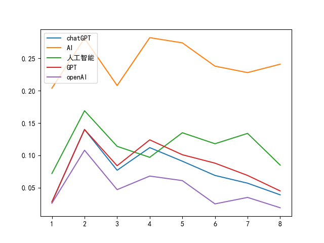
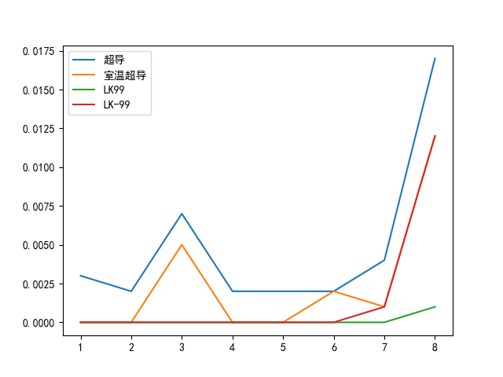
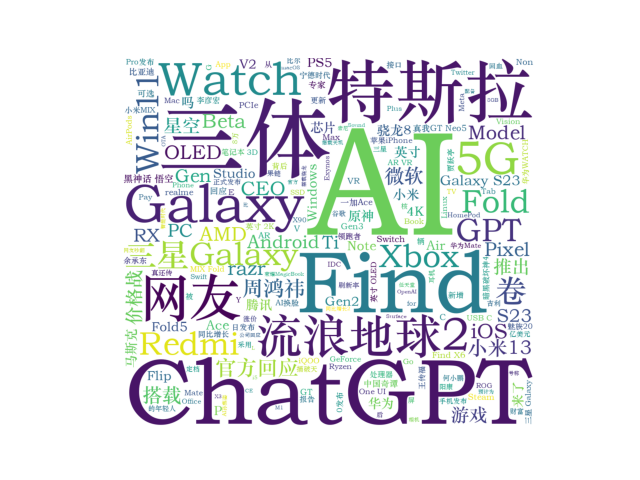
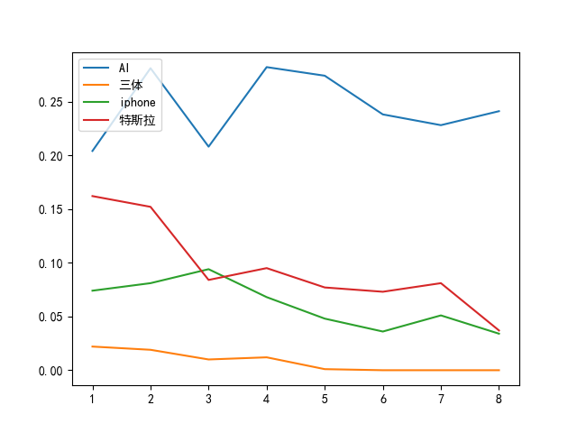

# 数据分析报告
## 结论1：社会舆论对于新技术的关注往往在技术实现后的一个月内达到高峰。
以下就2023年3月GPT-4的发布与7月LK-99材料的发现这两件技术新发展产生后的的社会舆论进行论证，相关代码如下：（原代码：news_web\matpl.py）  

    kinds={1: 1032, 2: 627, 3: 403, 4: 663, 5: 858, 6: 957, 7: 837, 8: 776}  #kinds中储存的为1~8月各月新闻总数
    words=['chatGPT','AI','人工智能','GPT','openAI']  #要进行搜取的关键词
    for query in words:  
        news_num=dict() #news_num列表记录关键词匹配的新闻总数
        for i in range(1,9): #分别在1~8月进行关键词搜索，统计新闻数量
            tp=get_object_or_404(Category,pk=i)
            news_tp=tp.news_set.all()
            news_list = news_tp.filter(Q(title__icontains=query) | Q(text__icontains=query))
            news_num[i]=len(news_list)
        scale=dict() #scale用于记录所搜取到的新闻占各月新闻总数的比例
        for i in range(1,9):
            scale[i]=round(news_num[i]/kinds[i],3)
        x=list()
        y=list()
        for i in range(1,9):  
            x.append(i)  
            y.append(scale[i])  
        plt.plot(x,y)  
    plt.rcParams['font.sans-serif']=['SimHei']#解决中文乱码  
    plt.rcParams['axes.unicode_minus']=False  
    plt.legend(words, loc='upper left')
    plt.show()
输出结果图片如下：  
  
不难看出，在3月GPT-4刚发布时，相关新闻数量占比并没有达到峰值，而4月经过一个月左右的社会舆论充分发酵后，有关新闻的占比相比3月有明显增加。  

修改代码中的关键词列表如下：
    
    words=['超导','室温超导','LK99','LK-99']
输出结果图片如下：  
  
与上个例子同理，尽管LK-99的发现这一信息于7月发布，但超导相关的新闻数量占比在8月才达到峰值。  
综上所述，我们合理推论，不考虑后续技术发展的情况下，社会舆论对于新技术的关注往往在技术实现后的一个月内达到最高潮。这一趋势在不同技术领域中都有比较明显体现，可以进一步研究社会舆论对于技术发展的动态变化，并制定相应的战略规划，更好地利用这一趋势。  
## 结论2：有关技术发展的科技新闻篇幅往往更长
我在django数据库中定义了Category类，将不同新闻按照篇幅分为了短讯/消息、长文/报道这两类，对应的id分别为9、10，此处我们结合wordcloud模块进行论证，分别绘制两个Category下的所有新闻的词云图：（原代码：news_web\word.py）

    tp=get_object_or_404(Category,pk=9)
    f="" 
    news_tp=tp.news_set.all()#查找所有短讯/消息类的新闻
    for new in news_tp:
        f+=f"{new.title}{new.text}"
    stop=set([...])#此处为停用词集合，详见原代码，此处不赘述
    wordcloud = WordCloud(  
        background_color = 'white',  
        font_path = 'C:\Windows\Fonts\STZHONGS.TTF',#设置显示中文  
        width = 1000,  
        height = 900,  
        margin = 2,
        stopwords=stop).generate(f) #对全部文本进行自动分词  
    plt.imshow(wordcloud)  
    plt.axis('off')  
    plt.show()
输出图片如下：（对应所有篇幅500字以下的新闻）  
  
容易看出所有短讯/消息的新闻部分以各式手机、显卡、电子设备等的发布消息为主（如iOS，AMD，Redmi，随心等）。    
修改代码中的类id如下：

    tp=get_object_or_404(Category,pk=10)
输出图片如下：（对应所有篇幅500字以上的新闻）  
  
两图对比可以看出，长文/报道类别中，出现了更多技术相关的关键词，如AI、GPT等。产生这种现象的原因也容易理解：有关技术发展的科技新闻通常需要更多的空间来详细介绍技术发展进程、同时预测技术可能产生的影响。    
由此我们作出推论：有关技术发展的科技新闻篇幅往往更长。
## 结论3：GPT-4发布后，以chatGPT为代表的人工智能已成为科技新闻常驻热点之一。
我们首先分析所有新闻的标题词云图，修改代码三至五行如下：

    all_news=news.objects.all()#获取全体新闻
    for new in all_news:
        f+=f"{new.title}"
输出图片如下：（对应所有新闻的标题内容）  
  
除去AI相关的关键词，其他主要词语如三体、流浪地球是受众广泛的科幻IP，特斯拉、小米、iOS是为大众熟知的技术公司，5G等科技概念也都是为人熟知的。由此我们作出推断，标题中大量出现的关键词往往是为大众广泛了解的概念。因此，同样大量出现的AI、GPT等也已经成为深入人心的常驻关键词。  

接着我们进行横向对比，选取几个具有代表性的关键词，计算其在新闻中所占的比例：（代码同结论1）  
  
对比不同颜色的折线图，AI相关新闻的占比也是科技新闻中占比最高的。

最后进行纵向对比，重新审视结论1中的折线图：  
  
尽管AI相关新闻占比在GPT-4发布的一个月后的峰值之后占比有所下降，但总比例仍然高于25%。这进一步证明了人工智能相关的新闻已经成为科技新闻的持久热点。  
综上所述，人工智能相关的新闻已成为科技新闻的常驻热点之一。

